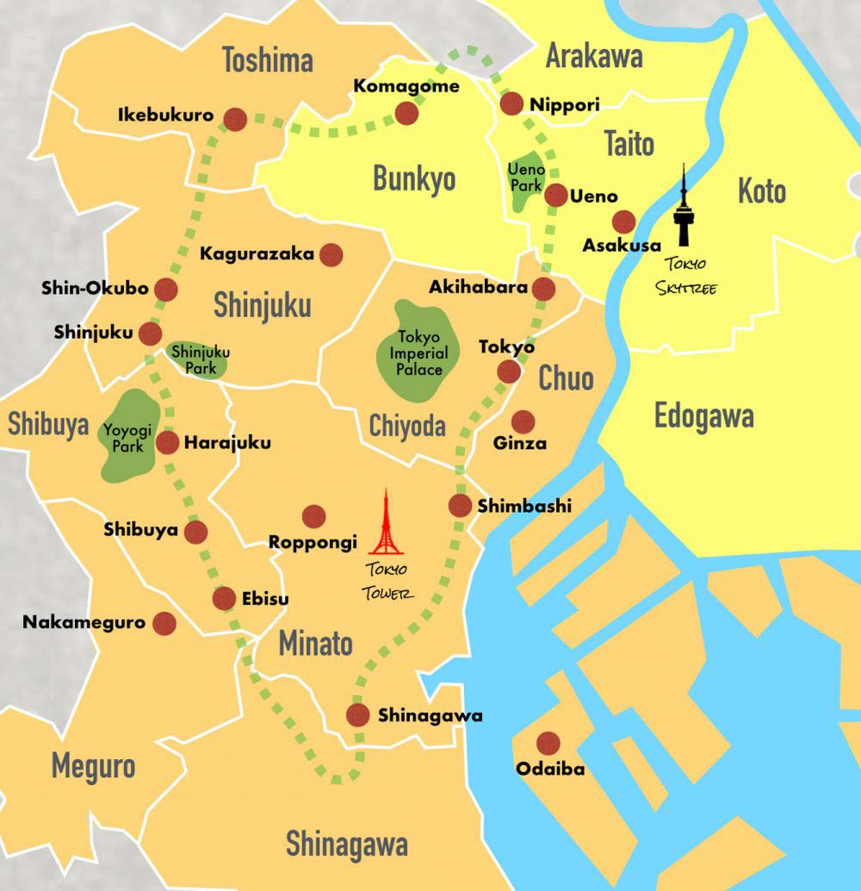
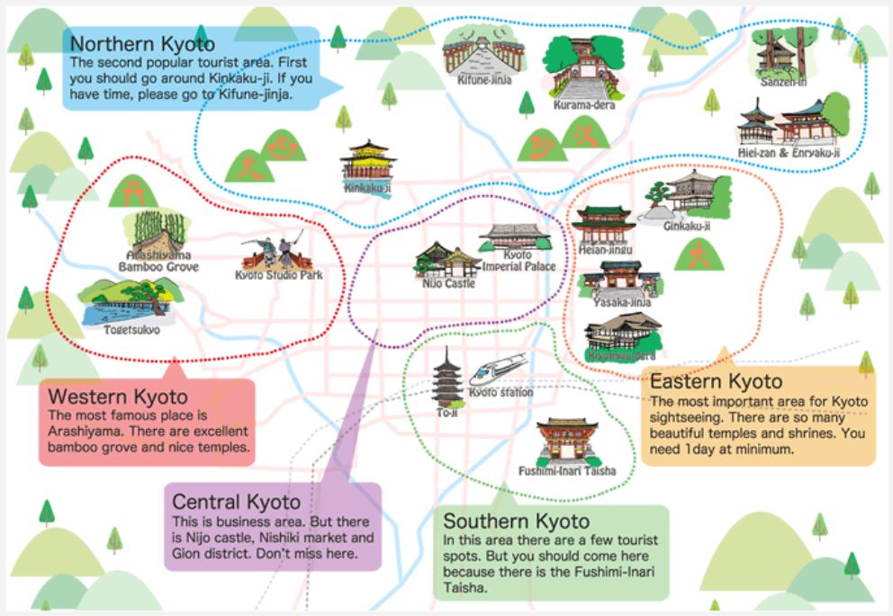

# Japan Trip Itinerary

## Table of Contents
- [Travel Itinerary](#travel-itinerary)
  - [Tokyo](#tokyo)
    - [Day 0 (Aug 10th)](#day-0-arrival-day-aug-10th)
    - [Day 1 (Aug 11th)](#day-1-aug-11th)
    - [Day 2 (Aug 12th)](#day-2-aug-12th)
    - [Day 6 (Aug 16th)](#day-6-aug-16th)
  - [Kyoto](#kyoto)
    - [Day 3 (Aug 13th)](#day-3-aug-13th)
    - [Day 4 (Aug 14th)](#day-4-aug-14th)
    - [Day 5 (Aug 15th)](#day-5-aug-15th)
- [Transportation Notes](#transportation-notes)
- [Maps for Tokyo and Kyoto](#tokyo-and-kyoto-maps)
- [Suggested Additions in Tokyo](#suggested-additions-in-tokyo)
- [Suggested Additions in Kyoto](#suggested-additions-in-kyoto)
- [To-Dos](#to-dos)

## Travel Itinerary:

### Tokyo
#### Day 0 (arrival day. Aug 10th):
- **Rainbow Bridge** (night-time)
  - Next to hotel (Shinagawa Prince)

#### Day 1 (Aug 11th):
- **Morning:**
  - ##### Sensoji temple
    - Most popular attraction. Get there early
    - Recommended time: 1 hour
    - Hotel -> Sensoji temple = ~35 minutes.

- **Central-ish**
  - Meiji Shrine (popular). Between Shinjuku and Shibuya. (1 hour)
  - Takeshita street (Shibuya area) (2-3 hours)
    - Pokemon center
  - Shibuya
    - Shibuya crossing

  - "6:00pm: Eat dinner in an area like Shinjuku, Ginza, Marunouchi or someplace close to your hotel. See the relevant district pages for recommendations."

#### Day 2 (Aug 12th):
- **Morning:**
  - Imperial Palace (1 hour)
  
  - Akihabara - famous electric town (Some say 2-3 hours. Some say half a day).
    - Famous for anime, cosplay
    - Donquijote (weird stuff and souvenirs)

  - ##### Ueno Park (usually paired with Sensoji temple). Ueno Park (2-3 hours)
    - "Visit the wonderful Tokyo National Museum, Ueno-koen Park and Tosho-gu Shrine and then make your way back to the station."

- **Afternoon:**

- **Evening:**
  - teamLab planets (~3 hours to look around). Reserved for 5pm.
  - Stay in capsule hotel

#### Day 6 (Aug 16th):
- **Morning:**
  - Make way back to Tokyo (2 hour commute time)

- **Afternoon:**
  - Ginza District
    - Shopping

### Kyoto
#### Day 3 (Aug 13th):
- **Morning:**
  - Shinkansen train (2 hours) - Morning train
  - Check-in to hotel

- **Late Morning:**
  - 11 am – Menbakaichida Fire Ramen – Lunch

- **Afternoon:**
  - Nijo Castle (~2 hours)

- **Late Afternoon:**
  - 3pm – Nishiki Market. Opens from 9am-6pm.

#### Day 4 (Aug 14th):
- **Morning:**
  - Fushimi Inari shrine. Visit early to beat crowds. Open 24/7. (1-2 hours)
    - "You should spend about 2 hours if you want to go to the top or less (about 1 hour) if you just go to the intersection to see the view."

- **Late Morning:**
  - Kiyomizu Dera Temple (2 hours).

- **Lunch:**
  - There are plenty of options for great restaurants for lunch around Fushimi Inari Shrine.
  - If you’re in the mood for sushi, Kyoto Train Station, has a great sushi train option, Ashami

- **Afternoon:**
  - Toji Temple (2 hours)

- **Evening:**
  - Ginkaku Temple - Silver Pavillion

#### Day 5 (Aug 15th):
- **Morning:**
  - Arashimaya (nature). One of the most popular locations in Kyoto. (you have to cross Togetukyo Bridge to get here)
    - Bamboo forest. - Ariashiyama Bamboo Grove. Come early to beat crowds. Open 24/7. (1 hour)

- **Late Morning:**
  - Togetsukyō Bridge (1 hour)
  - Tenryuji Temple (1 hour)
    - "Have Some Snack at Food Street
    Try the traditional Kyoto yudofu". https://www.mytravelbuzzg.com/day-trip-to-arashiyama-itinerary/
  - Ryoanji Temple and Lunch (3 hours)

- **Afternoon:**
  - Kinkaku-ji (Golden Pavillion). One of the most popular buildings in Japan. Opens at 9am. (1 hour)

- **Evening:**
  - Senkoji Temple (short hike). Scenic views. (1-2 hours)

## Transportation Notes:
- **Airport -> Tokyo**
  - Narita Express (free on JR rail pass)

- **Capsule Hotel**
  - For the experience

- **JR Pass** - Japan railway pass (get 1 week pass)
- **IC Card** - Can be used for a lot. Not only for trains but also storage, vending machines.

- **Tokyo -> Kyoto** through Shinkansen train (~2 hours commute)

### Tokyo and Kyoto Maps:

### Suggested Additions in Tokyo:
- Eno Area
- Tokyo Skytree

### Suggested Additions in Kyoto:
- More cultural things - Kiyomizu-Dera temple, Tenryu-Ji temple, and Gion District
  - Gion (Kyoto Traditional Entertainment District)
    - Uses IC card

- Yasaka Pagoda
  - Hokan-ji Temple

- Temples
  - Nanzen-ji temple
  - Eikan-do temple
  - Yasaka Shrine

- Food
  - Pontocho (food).
  - Ramen sen no Kaze (Tonokatsu Ramen). Busy place tho.

### To-Dos:
- [x] Finish filling in gaps
- [x] Reserve teamLab tickets and time
- [ ] Make capsule reservation for Aug 12th.
- [ ] Research foods to eat
- [ ] Download offline google maps for Tokyo & Kyoto

#### Food resources
- Sushi
  - Tsukiji fish market
  - Sushi no Midori (Ginza/Akasaka area): A very popular sushi restaurant with multiple locations in Tokyo (Ginza, Akasaka, and Shibuya etc). They serve good quality sushi at a reasonable price, and you definitely need to make reservations or wait in line. Avoid weekends and peak times (e.g. 12 pm and 7 pm etc).
  
  - Mantenzushi (Tokyo station and Nihonbashi): They serve two dozens sushi pieces and small dishes for only 6,800 JPY for their omakase sushi course. It used to be pretty popular only among locals, but now you will see a lot of foreign visitors. 

- Ramen
  - Ramen has regional differences
    - In Kyoto, though, you will see a lot of Tonkotsu, pork broth ramen. Tonkotsu is not originally from Kyoto, but as a big college town, Tonkotsu ramen is quite popular for college students as well as locals.
    - if you go to Hokkaido, you will see miso (fermented soybean) ramen and ramen with butter and corn as toppings
    - There are more than 20 ramen shops in this small neighborhood, including the main store of Tenkaippin, now a nationwide ramen chain from Kyoto.

  - Sugari (Karasuma): 
    - Another famous and popular ramen restaurant in downtown Kyoto. They renovated Machiya, an old Japanese house, and turned it into a ramen bar/restaurant. They serve wagyu beef ramen as well as intestine ramen, which is quite good.

- Okonomiyaki
- Shirouo (transparent fish that dances in mouth)
- Tsukune (Chicken meatballs)
- Wagashi (Japanese sweets)
- Chicken sashimi
- Unagi (eel)

- Websites
  - https://www.ninjafoodtours.com/tokyo-food-guide/#:~:text=Tokyo%20Food%20Guide%202023%3A%20Top%205%20Foods%20You,savory%20pancakes%29%20...%205%205.%20Soba%20noodles%20
  - https://www.japan-guide.com/e/e3075.html 

  - https://www.ninjafoodtours.com/kyoto-food-guide/
